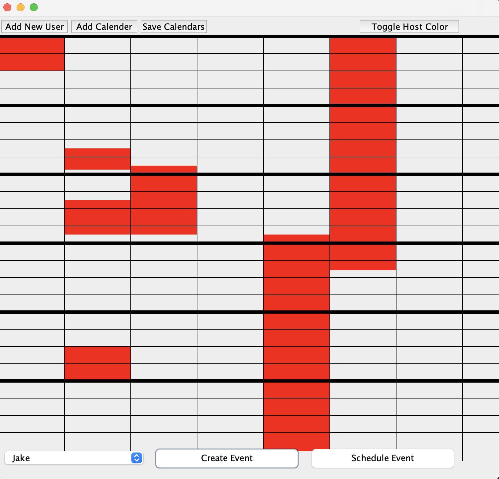

# NU Planner

A Java-based scheduling application built with the **Model-View-Controller (MVC)** pattern. The planner allows users to create, modify, and view multiple schedules through an interactive GUI.

---

## Overview

- Built in **Java** using **Swing**, **AWT**, and **I/O** packages  
- Uses **XML parsing and DOM manipulation** to read and write schedules  
- Supports multiple scheduling modes:
  - `anytime` – schedule freely
  - `workhours` – restrict scheduling to defined work hours

---

## Run Instructions

1. Compile the project:

  ```bash
   javac -d out src/*.java src/planner/**/*.java
   ```

2. Run the program:

  ```bash
    java -cp out Planner anytime sunday
 
    # or

    java -cp out Planner workhours saturday
  ```

## Example XML

```xml
<?xml version="1.0"?>
<schedule id="Jake"><event>
  <name>Work</name>
    <time>
      <start-day>Monday</start-day>
      <start>900</start>
      <end-day>Monday</end-day>
      <end>1500</end>
    </time>
    <location>
      <online>false</online>
      <place>Office</place>
    </location>
    <users>
      <uid>Jake</uid>
    </users>
  </event>
</schedule>
```

## Interface Example



## Author

Jake Bernhard